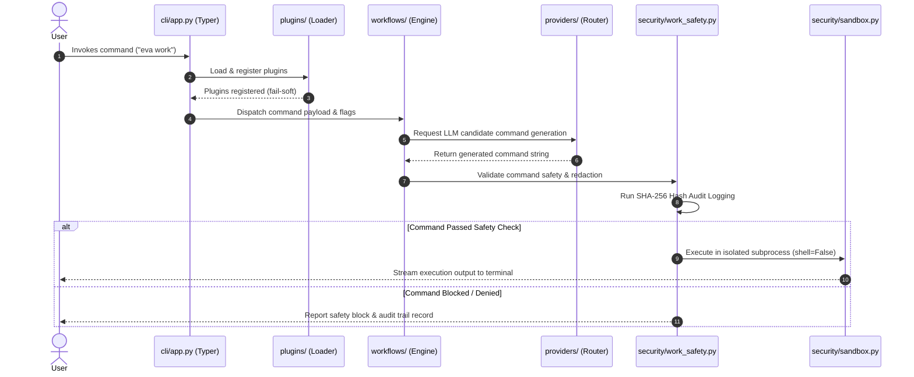

# Architecture & Request Flow

This document details the modular architecture of Eva (`src/eva/`) and traces the request flow from CLI invocation down to sandboxed command execution.

---

## Request Flow Architecture

The sequence diagram below illustrates the end-to-end request flow for a command execution query (`eva work`):

---

## Component Layout (`src/eva/`)

Eva is structured into decoupled Python sub-modules:

| Directory | Responsibilities |
| --- | --- |
| `cli/` | Typer CLI entry points, argument parsing, shell completion, interactive terminal UI prompts. |
| `plugins/` | Plugin discovery via `importlib.metadata.entry_points`, `EvaPlugin` protocol, fail-soft loader. |
| `workflows/` | Declarative multi-step engine, session state machine, prompt assembly. |
| `providers/` | Multi-provider router (Groq, OpenRouter, Gemini, OpenCode Zen, Ollama, llama.cpp), fallback handler. |
| `security/` | Secret redaction (`work_safety.py`), entropy analysis, SHA-256 audit logger, subprocess sandbox (`sandbox.py`). |
| `indexing/` | `.gitignore`-aware file collector, directory tree generator, local search, offline tokenizer. |
| `cache/` | Disk-backed response caching and SHA-256 digest lookup. |
| `workspace/` | Session workspace management, notes, bookmarks, and activity logs. |
| `replay/` | Terminal session recorder and player with secret redaction. |
| `telemetry/` | Anonymized latency/error metrics collector (disabled by default). |

---

## Plugin Discovery & Lifecycle

Eva discovers plugins at startup via Python's `importlib.metadata.entry_points` under the group `"eva.plugins"`. Each plugin must:

1. Subclass `EvaPlugin` from `eva.plugins`.
2. Register an entry point in `pyproject.toml` under `[project.entry-points."eva.plugins"]`.
3. Implement optional lifecycle hooks: `register_commands()`, `register_providers()`, `register_workflow_hooks()`.

Broken plugins log a warning and are skipped without crashing CLI startup (fail-soft safety).

---

## Detailed Execution Pipeline

1. **CLI Parsing (`cli/app.py`)**:
   Typer handles option flags (`--dry-run`, `--dry-run-explain`, `--allow-shell-features`, `--file`), validates input arguments, and delegates logic to the workflow engine.

2. **Plugin Loading (`plugins/loader.py`)**:
   All installed plugins are discovered and their commands, providers, and hooks are registered.

3. **Workflow & Prompt Assembly (`workflows/`)**:
   Context collector reads requested files/directories while skipping `.gitignore` matches and heavy binary assets. Assembles the final prompt with safety instructions.

4. **Provider Fallback Routing (`providers/`)**:
   The provider router queries the primary backend (e.g. Groq). If a rate limit or network error occurs, it sequentially tries fallback backends until a valid response is generated.

5. **Security Verification (`security/work_safety.py`)**:
   Extracted command undergoes:
   - Secret/token redaction scan.
   - Argv shlex syntax verification (`shell=False`).
   - Blast-radius denylist check (`rm -rf /`, `mkfs`, `dd`).
   - Opt-in allowlist check (`allowed_command_prefixes`).
   - SHA-256 hash-chained audit logging (`~/.config/eva/command_audit.jsonl`).

6. **Sandboxed Subprocess Execution (`security/sandbox.py`)**:
   If user approves execution, the command runs in an isolated subprocess with environment variable sanitization, `stdin=DEVNULL`, and a strict 30-second timeout.
